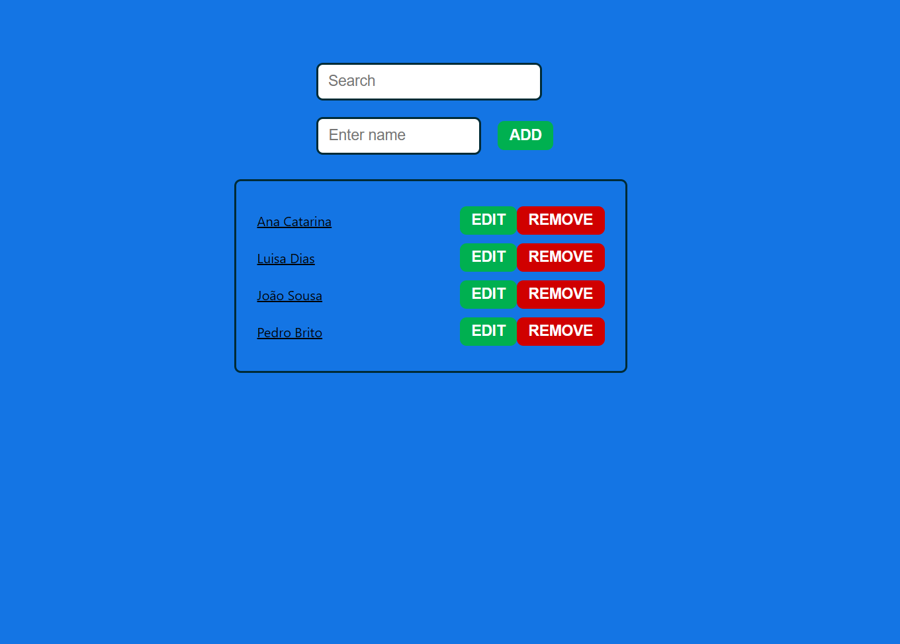

# Simple Name Manager

Uma aplicação simples em React que permite adicionar, editar, remover e pesquisar nomes. Os dados são armazenados localmente no browser através do `localStorage`, garantindo persistência mesmo após fechar a página.

## 🧩 Funcionalidades

- ✅ Adicionar novos nomes
- ✏️ Editar nomes existentes
- ❌ Remover nomes
- 🔍 Pesquisar por nomes em tempo real
- 💾 Armazenamento no `localStorage`

## 🖥️ Tecnologias utilizadas

- [React](https://reactjs.org/)
- JavaScript (ES6+)
- HTML5 + CSS3

## 📦 Instalação e execução local


1. Clona o repositório:
   ```bash
   git clone https://github.com/teu-utilizador/simple-name-manager.git
   cd simple-name-manager

2. Instala as dependências:

- npm install

3. Inicia a aplicação:

- npm start

4. Acede à aplicação em: http://localhost:3000


📌 Notas

    - A pasta node_modules foi excluída para reduzir o tamanho do projeto.

    - O .gitignore está configurado para ignorar ficheiros desnecessários.

---

## 🛠 Atualizações

- **07-07-2025**
A interface foi recentemente atualizada para apresentar um layout mais limpo, com os campos de pesquisa e inserção de nomes melhor organizados horizontalmente.



---

## 📂 Estrutura do Projeto

```bash
SIMPLE-NAME-MANAGER/
├── src/
│   ├── components/
│   │   └── NameList.js
│   └── App.jsx
├── public/
│       ├── index.js
│       ├── App.js
│       └── styles.css
├── .gitignore
├── package-lock.json
├── package.json
└── README.md
```
-----
👨‍💻 Autor

Amadeu Dongo Rocha

-----